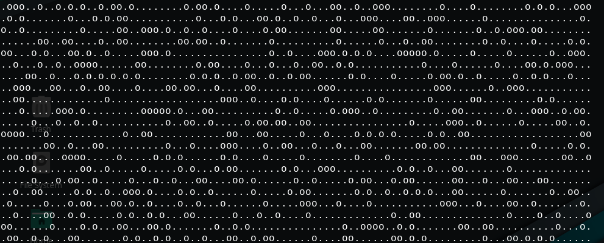
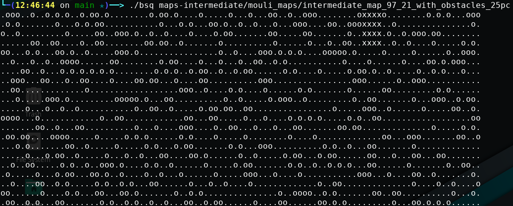

# BiggestSquare
This guy can find the biggest free square in the map you're giving it.

# usage : 
`./bsq map`

The unsolved map looks like this, '.' meaning free spaces, and 'o' meaning pillars

And the solved one will have X's in lieue of the biggest free space

